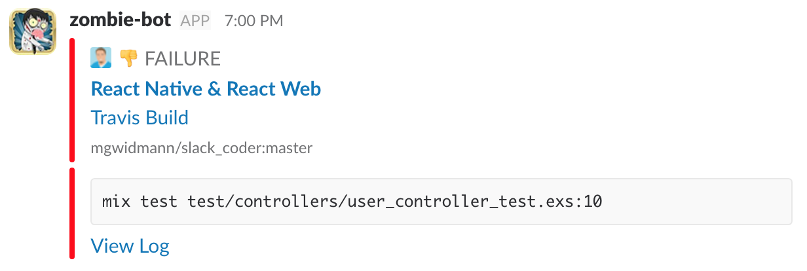
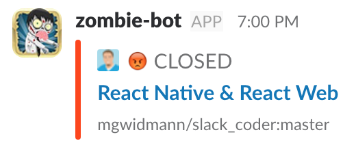

SlackCoder
==========

## Slack Bot for watching your Github & (CI) builds

This slack bot receives webhooks from Github and ensures that you're kept up to date by sending your a message in slack with the status of pull-requests you're interested in. The purpose of this bot is to increase productivity by reducing the feedback loop between when actions happen on Github and when you have time to follow up by keeping you more informed about their status.

### Web Dashboard

The web dashboard helps you to separate out your pull requests from your teammates pull requests. This gives you the advantage of being informed on certain event types about your teammates that may interest you. For example, you may not care when you teammate's build fails, but if you're responsible for merging you do care about when it succeeds. For your own pull requests you do need to know when they fail and for what reason. Slack bot lets you configure different notification types between yourself and those you monitor.

[]()

### Slack Notifications

#### Build Success

The CI system analysis for this pull request is green ✅!

[]()

#### Build Failure

Build failures will check the Travis API and parse the log files to determine which test failed before reporting their failure to you. This helps to let you know at a quick glance what action you may need to take next.

[]()

#### Merge Conflict

Every 5 minutes or so, merge conflicts are checked on each pull request. This helps to prevent a common deadlock between developers where they're waiting on you to fix the conflicts and you're waiting on them to merge the pull request.

[]()

#### Merged

Lets you know when pull requests merge so you can rejoice. 🎉

[]()

#### Closed

Lets you know when you pull request has been closed 😢

[]()

#### Stale (Disabled)

Pull requests go stale after the two hours have passed (during working hours) in which no commits or comments have been made. The time necessary to send each stale message increases on an exponential backoff as to prevent annoyance of the same old pull requests bothering you.

[]()

#### Active (Disabled)

Pull requests become active again once either a commit or comment has been added to it (and it was previously stale). This lets you know your pull request is active again so you can help get it through.

[]()

### Development Setup

#### Nanobox

You'll have to [install the nanobox CLI](https://docs.nanobox.io/install/) tool first.

1. `git clone git@github.com:mgwidmann/slack_coder.git`
2. `cd slack_coder`
3. `nanobox dns add local slack-coder.dev` and follow instructions
4. `nanobox evar add local MIX_ENV=dev`
5. `nanobox run mix do ecto.create, ecto.migrate, run priv/repo/seeds.exs` to migrate your local database
6. `nanobox info local` to get database access credentials

Create a `config/dev.secret.exs` config file with the following contents and fill out values:

```elixir
use Mix.Config

slack_api_token = "...snip..."
config :slack_coder,
  slack_api_token: slack_api_token,
  personal: true,
  caretaker: :your_slack_user_name_so_dev_messages_only_come_to_you,
  random_failure_channel: "#travis-fails",
  travis_token: "...snip...",
  travis_public_token: "...snip...",
  circle_ci_token: "...snip..."

config :slack,
  api_token: slack_api_token

config :slack_coder, :github,
  pat: "...snip...",
  user: "your_github_user_name_goes_Here"

config :ueberauth, Ueberauth.Strategy.Github.OAuth,
  client_id: "...snip...",
  client_secret: "...snip..."

config :slack_coder, SlackCoder.Guardian,
  secret_key: "...snip..." # Doesn't matter, generate a new one with `mix guardian.gen.secret`

config :slack_coder, :notifications,
  min_hour: 0,
  max_hour: 24,
  always_allow: true,
  days: [1,2,3,4,5,6,7]
```

To start it up, run `nanobox run iex -S mix phoenix.server` and access at http://slack-coder.dev:4000/

### Production

#### Configuring

You'll need to set the following environment variables in order for the application to work properly:

* SECRET_KEY_BASE
  * Generate a new one with `mix phx.gen.secret`
* PORT
  * If using nanobox, set this to 80 otherwise you should know what to put here
* SLACK_CODER_HOST_NAME
  * The domain name where your application is deployed.
* DATA_DB_USER
  * Username to your database (This value is set by nanobox)
* DATA_DB_PASS
  * Password for the user to your database (This value is set by nanobox)
* DATA_DB_HOST
  * Host name where your database is located (This value is set by nanobox)
* SLACK_API_TOKEN
  * Find your token here: https://api.slack.com/web
* SLACK_CODER_RANDOM_FAILURE_CHANNEL
  * Name of the channel where to post random failures
* TRAVIS_API_TOKEN
  * Learn how to create one of these here: https://docs.travis-ci.com/api#authentication
* CIRCLE_CI_TOKEN
  * ... NOT YET IMPLEMENTED ...
* GITHUB_PAT
  * Create your token here: https://github.com/settings/tokens
* GITHUB_USER
  * The username which matches with your GITHUB_PAT
* GITHUB_CLIENT_ID
  * Register your oauth application here: https://developer.github.com/apps/building-integrations/setting-up-and-registering-oauth-apps/registering-oauth-apps/
* GITHUB_CLIENT_SECRET
  * Register your oauth application here: https://developer.github.com/apps/building-integrations/setting-up-and-registering-oauth-apps/registering-oauth-apps/
* GUARDIAN_SECRET
  * Generate this with `mix guardian.gen.secret`

If you'd like to modify the configuration on when notifications are sent, change the following:

```elixir
config :slack_coder, :notifications,
  # For stale PR notifications
  # The minimum hour to send a notification (Just stale, passes/fails don't apply)
  min_hour: 8,
  # The maximum hour to send a notification (Just stale, passes/fails don't apply)
  max_hour: 17,
  # If you prefer to just always send notifications (don't bother with min/max then)
  always_allow: false,
  # The days on which to send stale PR notifications, 1 starts Monday
  # See Timex.Date.day_name/1 for more info
  days: [1,2,3,4,5]
```

#### Deployment

Just run `nanobox deploy`. Thats it!
